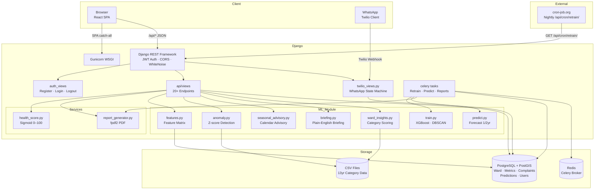
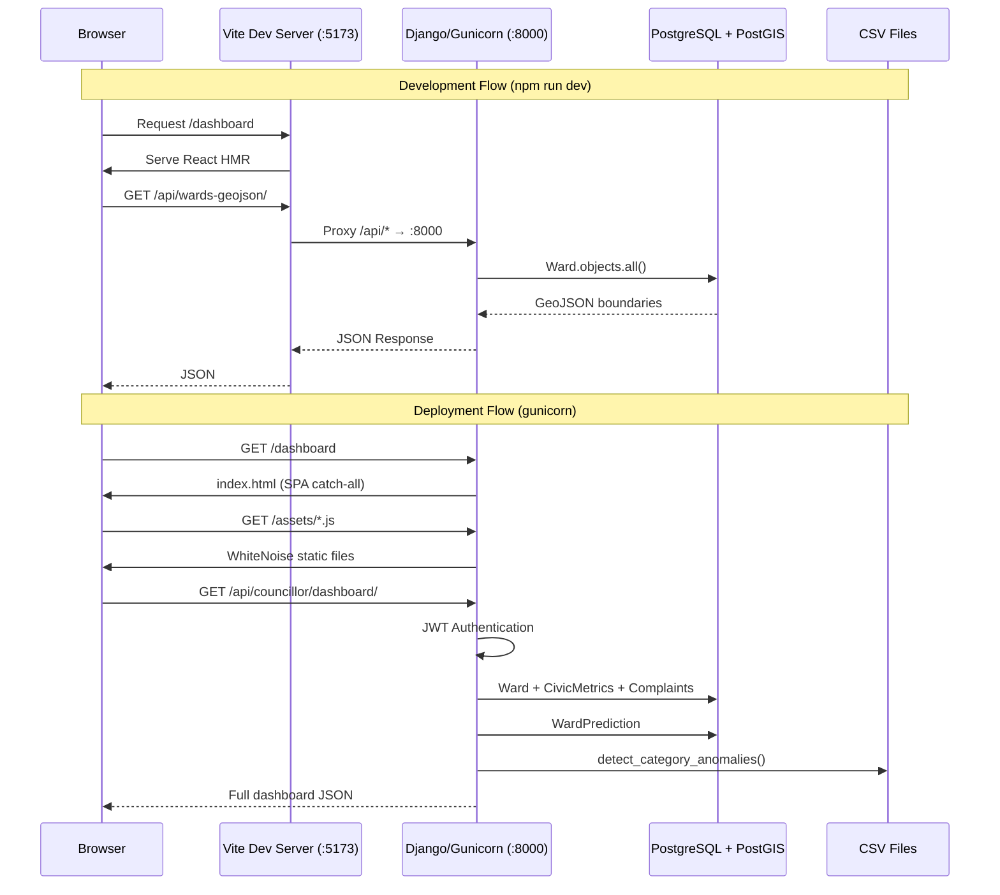
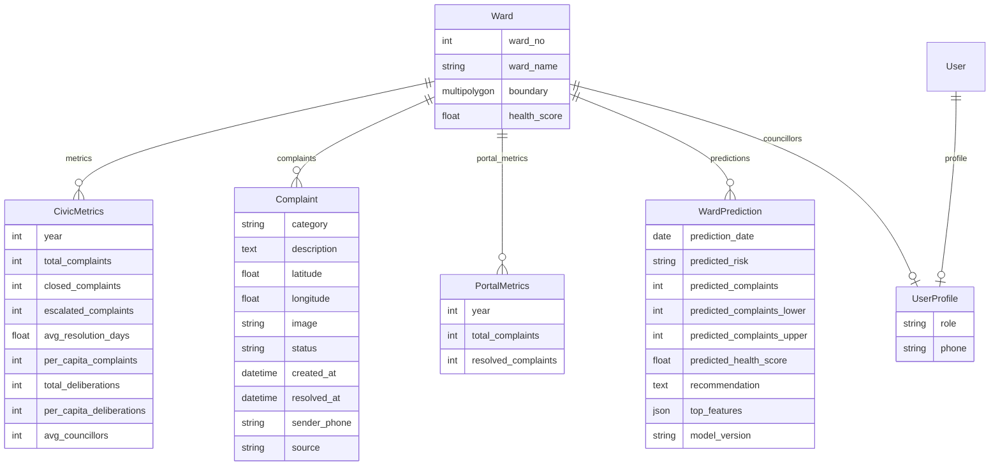
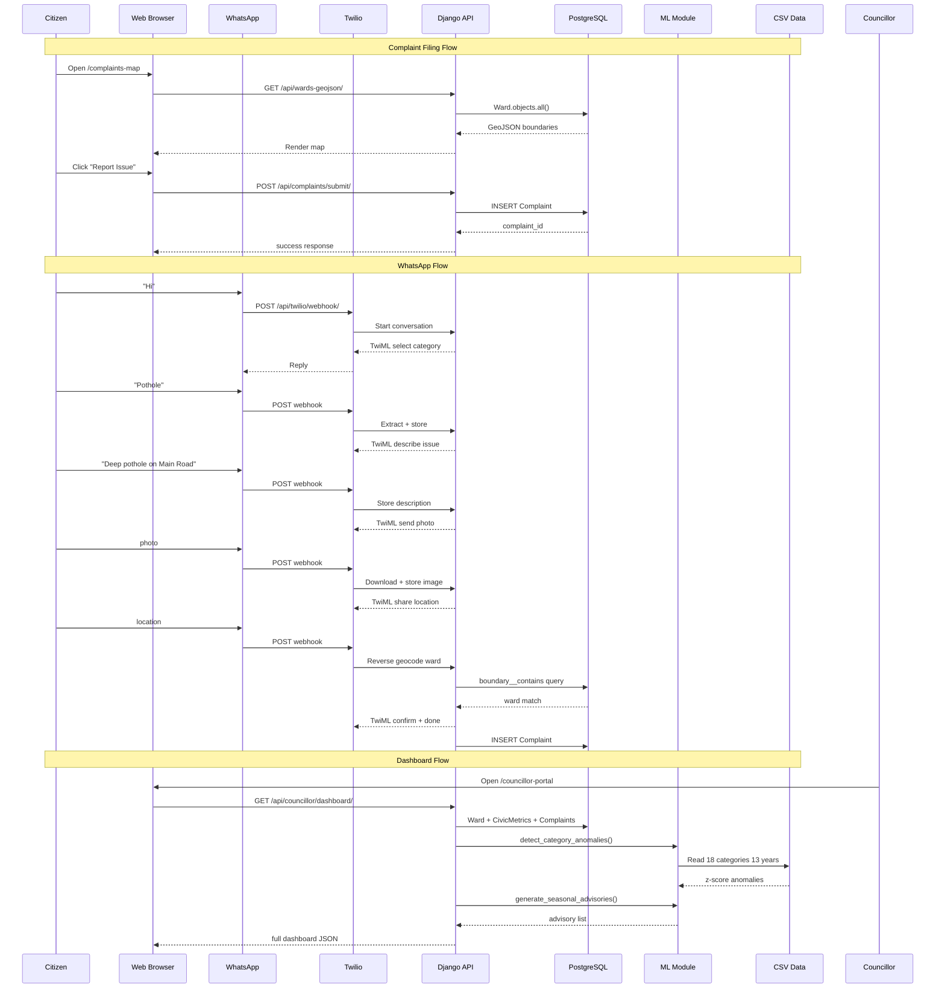

# UrbanIQ — Mumbai Urban Intelligence Platform

[](https://www.python.org/)
[](https://www.djangoproject.com/)
[](https://postgis.net/)
[](https://react.dev/)
[](https://vite.dev/)
[](https://xgboost.readthedocs.io/)
[](https://leafletjs.com/)
[](https://www.docker.com/)
[](https://www.twilio.com/)
[](https://docs.celeryq.dev/)

UrbanIQ is an open civic-tech platform that tracks infrastructure health across Mumbai's 24 municipal wards. It aggregates public complaint data from the Praja Foundation, allows citizens to file new complaints via web or WhatsApp, computes ward-level health scores from civic metrics, and uses XGBoost to forecast complaint volumes and risk levels 1–2 years ahead. The platform also runs z-score anomaly detection on 18 Praja complaint categories and generates proactive seasonal advisories for councillors.

---

## Key Features

- **Interactive Ward Map** — Leaflet choropleth of 24 Mumbai wards colour-coded by health score with click-to-inspect detail panels
- **Ward Health Scores** — Composite 0–100 score derived from per-capita complaints, resolution speed, and civic deliberation metrics using sigmoid-weighted normalization
- **Citizen Complaint Portal** — File geotagged complaints (pothole, water, garbage, etc.) with photo uploads and track resolution status
- **ML Complaint Forecasting** — XGBoost classifiers and quantile regressors trained on 6+ years of ward-level metrics forecast complaint volumes with 10th/90th percentile prediction intervals
- **Anomaly Detection** — Z-score based anomaly detection across 18 Praja foundation categories flags city-wide complaint surges and trend-breaks using 13 years of historical data
- **Seasonal Advisory System** — Calendar-based proactive warnings for drainage, roads, water supply, storm water drainage, and pest control categories, augmented with real anomaly growth context
- **WhatsApp Complaint Bot** — Step-by-state Twilio-powered WhatsApp conversation for filing complaints, uploading images, and auto-ward identification via PostGIS reverse geocoding
- **Councillor Dashboard** — Per-ward analytics including health history, complaint breakdown, ML forecasts, seasonal advisory, anomaly-driven briefings, and PDF report generation
- **GeoJSON API** — Serve ward boundary MultiPolygons for client-side rendering
- **DBSCAN Hotspot Detection** — Density-based clustering of complaint coordinates identifies spatial complaint clusters
- **Automated Nightly Retraining** — Cron endpoint syncs portal complaints, rebuilds feature matrices, retrains all models, and generates fresh predictions
- **Celery Background Tasks** — Async task queue for model retraining, prediction generation, and PDF report creation

---

## Tech Stack

| Layer | Technology |
|-------|-----------|
| **Backend** | Django 5.2, Django REST Framework 3.17, Python 3.12 |
| **Database** | PostgreSQL 16 + PostGIS 3 |
| **Machine Learning** | XGBoost 2.1, scikit-learn 1.5, pandas 2.2, NumPy 1.26, joblib 1.4 |
| **Frontend** | React 19, Vite 8, React Router 7, Leaflet 1.9 (react-leaflet 5), Recharts 3.8, Lucide React |
| **Authentication** | SimpleJWT (access + refresh tokens) with token blacklisting |
| **Background Tasks** | Celery 5.6 with Redis 8 broker |
| **WhatsApp** | Twilio 9.10 (inbound webhook + outbound status updates) |
| **PDF Generation** | fpdf2 2.8 |
| **Static Files** | WhiteNoise 6.12 with compressed manifest storage |
| **CORS** | django-cors-headers 4.9 |
| **ASGI/WSGI** | Gunicorn 23 (WSGI), Django ASGI (fallback) |
| **Deployment** | Docker (multi-stage), Render, Cloudflare Pages |

---

## System Architecture



---

## Request Flow



---

## Project Structure

```
MumbaiUI/
├── Dockerfile                         # Multi-stage: Python backend + Node frontend
├── .env.example                       # Environment variable template
├── backend/
│   ├── build.sh                       # Render deployment build script
│   ├── Dockerfile                     # Backend-only Docker image
│   ├── entrypoint.sh                  # Startup: migrate, seed, train, gunicorn
│   ├── Procfile                       # Render web process definition
│   ├── runtime.txt                    # Python 3.12.4
│   ├── requirements.txt               # Python dependencies (19 packages)
│   ├── manage.py                      # Django CLI entry point
│   ├── config/
│   │   ├── settings.py                # Django settings (DB, CORS, auth, cache, Celery)
│   │   ├── urls.py                    # Root URL conf (admin, API, SPA catch-all)
│   │   ├── wsgi.py / asgi.py          # WSGI + ASGI application entry points
│   │   └── celery.py                  # Celery app + task auto-discovery
│   ├── api/
│   │   ├── models.py                  # 6 models: Ward, CivicMetrics, Complaint, PortalMetrics, WardPrediction, UserProfile
│   │   ├── serializers.py             # DRF serializers with nested profile + ward
│   │   ├── views.py                   # 20+ API endpoints (~930 lines)
│   │   ├── urls.py                    # API URL routing (22 patterns)
│   │   ├── auth_views.py              # Register, login, profile, logout
│   │   ├── twilio_views.py            # WhatsApp conversation state machine
│   │   ├── tasks.py                   # Celery tasks: retrain, predict, generate reports
│   │   ├── tests.py                   # 22 tests (ML pipeline + anomaly + advisory + caching)
│   │   ├── admin.py                   # Django admin model registration
│   │   ├── apps.py                    # App config
│   │   ├── services/
│   │   │   ├── health_score.py        # Sigmoid-weighted 0–100 health score computation
│   │   │   └── report_generator.py    # fpdf2 ward PDF report generator
│   │   └── management/commands/
│   │       ├── load_wards.py          # Load 24 ward boundaries from GeoJSON
│   │       ├── load_metrics.py        # Load CivicMetrics from ward_metrics CSV
│   │       ├── update_health_scores.py# Recompute + persist health scores
│   │       ├── train_models.py        # Build feature matrix + train XGBoost/DBSCAN
│   │       └── seed_complaints.py     # Seed 25 complaints/ward with seasonal distribution
│   ├── ml/
│   │   ├── utils.py                   # Model I/O (joblib), path constants
│   │   ├── features.py                # build_feature_matrix() with lag/rolling features
│   │   ├── train.py                   # XGBClassifier (risk) + XGBRegressor (3 quantiles) + DBSCAN
│   │   ├── predict.py                 # generate_predictions() for 1/2 year horizons
│   │   ├── preprocess.py              # StandardScaler transform for inference
│   │   ├── anomaly.py                 # Z-score anomaly: category, ward, trend-break
│   │   ├── briefing.py                # Template-based plain-English ward briefing
│   │   ├── recommendations.py         # Rule-based recommendation engine
│   │   ├── ward_insights.py           # Category-ward severity scoring from CSV
│   │   ├── seasonal_advisory.py       # Calendar-based proactive seasonal warnings
│   │   └── models/                    # Trained .pkl files (gitignored)
│   ├── data/                          # CSV datasets
│   │   ├── Table_1_Issue_Wise_Overall_Complaints.csv  # 18 categories, 2012–2024
│   │   ├── ward_metrics_multiyear.csv                  # 24 wards, 8 years
│   │   ├── escalation_data.csv                         # Category escalation rates
│   │   └── ...
│   └── mumbai_wards.geojson           # 24-ward MultiPolygon boundaries
├── frontend/
│   ├── package.json                   # React 19, Leaflet, Recharts, React Router 7
│   ├── vite.config.js                 # Vite 8 with /api + /media proxy to :8000
│   ├── index.html
│   ├── _routes.json                   # Cloudflare Pages routing config
│   ├── functions/api/[[path]].js      # Cloudflare Pages serverless API proxy
│   └── src/
│       ├── main.jsx                   # React entry
│       ├── App.jsx                    # Router + landing page (8 routes)
│       ├── config.js                  # API_BASE path resolution
│       ├── context/AuthContext.jsx     # Auth state: login, register, logout, token refresh
│       ├── pages/
│       │   ├── Dashboard.jsx          # City-wide analytics with 5 tabs
│       │   ├── CouncillorPortal.jsx   # Per-ward dashboard (~1200 lines)
│       │   ├── AdminPortal.jsx        # Admin complaint management
│       │   ├── PublicDashboard.jsx    # Public city health summary
│       │   ├── ComplaintsMap.jsx      # Leaflet complaint map
│       │   ├── TrackComplaint.jsx     # Complaint lookup by ID
│       │   ├── Login.jsx             # Login form (username/email)
│       │   └── Signup.jsx            # Registration with role/ward selection
│       └── components/
│           ├── MumbaiMap.jsx          # Leaflet ward choropleth
│           ├── ComplaintModal.jsx     # Complaint form (~485 lines)
│           ├── CouncillorTable.jsx    # Sortable councillor engagement table
│           ├── WardDetailPanel.jsx    # Ward detail slide-over panel
│           └── Navbar.jsx            # Responsive navbar
└── scripts/
    └── UrbanIQ_Interview_Cheat_Sheet.pdf
```

---

## Installation & Local Setup

### Prerequisites

- Python 3.12
- PostgreSQL 16 with PostGIS 3
- Node.js 20+
- GDAL (for PostGIS geometry operations on Windows)

### 1. Clone

```bash
git clone https://github.com/MohdSaadMa07/Urban-Infrastructure-Intelligence-Platform.git
cd Urban-Infrastructure-Intelligence-Platform
```

### 2. Backend Setup

```bash
cd backend
python -m venv venv
source venv/bin/activate     # Windows: venv\Scripts\activate
pip install -r requirements.txt
```

### 3. Database Setup

```bash
createdb muip
psql muip -c "CREATE EXTENSION postgis;"

# Run migrations
python manage.py migrate
```

### 4. Load Seed Data

```bash
python manage.py load_wards
python manage.py load_metrics --csv data/ward_metrics_multiyear.csv
python manage.py update_health_scores
python manage.py seed_complaints        # Creates 25 complaints per ward
```

### 5. Train ML Models

```bash
python manage.py train_models
```

### 6. Frontend Setup

```bash
cd ../frontend
npm install
```

---

## Environment Variables

Create `backend/.env` from the template at `.env.example`:

```env
# Django
DJANGO_SECRET_KEY=
DJANGO_DEBUG=True
DJANGO_ALLOWED_HOSTS=localhost,127.0.0.1
DJANGO_CORS_ALLOWED_ORIGINS=http://localhost:5173,http://127.0.0.1:5173
DJANGO_CSRF_TRUSTED_ORIGINS=http://localhost:5173,http://127.0.0.1:5173

# Database (leave empty for local defaults below)
DATABASE_URL=

# PostGIS Database (defaults used when DATABASE_URL is not set)
DB_NAME=muip
DB_USER=postgres
DB_PASSWORD=
DB_HOST=localhost
DB_PORT=5432

# GDAL (Windows with PostGIS bundle)
GDAL_LIBRARY_PATH=C:\Program Files\PostgreSQL\18\bin\libgdal-35.dll
GEOS_LIBRARY_PATH=C:\Program Files\PostgreSQL\18\bin\libgeos_c.dll

# Celery / Redis (optional for dev)
CELERY_BROKER_URL=redis://localhost:6379/0
CELERY_RESULT_BACKEND=redis://localhost:6379/0

# Twilio WhatsApp (optional without WhatsApp)
TWILIO_ACCOUNT_SID=
TWILIO_AUTH_TOKEN=
TWILIO_WHATSAPP_NUMBER=whatsapp:+14155238886

# Cron retrain API key
CRON_API_KEY=
```

If `DJANGO_SECRET_KEY` is not set and no `secret_key.txt` exists, one is auto-generated and persisted to `backend/secret_key.txt` on first run.

---

## Running the Project

### Backend (Django Dev Server)

```bash
cd backend
python manage.py runserver
# API: http://localhost:8000/api/
```

### Frontend (Vite Dev Server)

```bash
cd frontend
npm run dev
# App: http://localhost:5173
# Vite proxies /api/* and /media/* to Django on http://127.0.0.1:8000
```

### Running with Docker

```bash
docker build -t urbaniq .
docker run -p 8000:8000 urbaniq
```

---

## Database Design

### Entity Relationship



### Key Constraints

- `CivicMetrics`: `unique_together(ward, year)` — one metric row per ward per year
- `PortalMetrics`: `unique_together(ward, year)` — one portal metric row per ward per year
- `Complaint.category`: constrained to `[pothole, water, drainage, garbage, streetlight, road, other]`
- `Complaint.source`: constrained to `[portal, whatsapp]`
- `WardPrediction`: stores both point forecast and 10th/90th percentile bounds

---

## API Documentation

### Public Endpoints

| Method | Endpoint | Description |
|--------|----------|-------------|
| `GET` | `/api/` | Health check — returns `{"status": "ok"}` |
| `GET` | `/api/wards/` | List all wards (id, ward_no, ward_name) |
| `GET` | `/api/wards-geojson/` | GeoJSON FeatureCollection of all ward MultiPolygon boundaries |
| `GET` | `/api/identify-ward/?lat=&lng=` | PostGIS reverse geocode — returns ward containing the point |
| `GET` | `/api/health-scores/` | Ward health scores with component breakdowns. Params: `?ward=`, `?year=` |
| `GET` | `/api/trends/` | 5-year historical trends (total_complaints, closed_complaints per ward). Params: `?ward=` |
| `GET` | `/api/hotspots/` | DBSCAN complaint clusters. Params: `?ward=` |
| `GET` | `/api/councillors/` | Ward councillor deliberation and engagement scores |
| `GET` | `/api/complaints/` | Paginated complaint list (50/page). Params: `?ward=`, `?page_size=` |
| `GET` | `/api/complaints/<id>/` | Single complaint detail |
| `POST` | `/api/complaints/submit/` | File a new complaint. Body: `{ward_name, category, description, latitude, longitude, image?, sender_phone?, source?}` |
| `PATCH` | `/api/complaints/<id>/status/` | Update complaint status. Body: `{status}`. Sends WhatsApp notification |
| `GET` | `/api/public/wards/` | Public ward health scores. Params: `?year=` |
| `GET` | `/api/public/summary/` | City-wide health aggregation (avg score, wards above 70/above 45) |
| `GET` | `/api/public/config/` | WhatsApp configuration (number, link, bot status) |

### Authenticated Endpoints

| Method | Endpoint | Auth | Description |
|--------|----------|------|-------------|
| `POST` | `/api/auth/register/` | — | Create user. Body: `{username, email, password, password2, role, ward_name?, phone?}` |
| `POST` | `/api/auth/login/` | — | Login (username or email). Body: `{username, password}` → `{user, access, refresh}` |
| `POST` | `/api/auth/login/refresh/` | — | JWT refresh. Body: `{refresh}` → `{access}` |
| `GET` | `/api/auth/profile/` | JWT | Current user profile with nested role, ward, phone |
| `POST` | `/api/auth/logout/` | JWT | Blacklist refresh token. Body: `{refresh}` |
| `GET` | `/api/councillor/dashboard/` | JWT | Full councillor dashboard: health history, predictions, anomaly briefing, seasonal advisories, category scores, complaints, hotspot data |
| `GET` | `/api/reports/download/` | JWT | Download ward PDF report. Params: `?ward=` |

### Maintenance Endpoints

| Method | Endpoint | Auth | Description |
|--------|----------|------|-------------|
| `GET/POST` | `/api/cron/retrain/?key=` | X-API-Key header/param | Sync portal complaints → build feature matrix → retrain risk/forecast/cluster models → save predictions for 1–2 years |

### WhatsApp Webhook

| Method | Endpoint | Description |
|--------|----------|-------------|
| `POST` | `/api/twilio/webhook/` | Twilio inbound message handler. Returns XML TwiML. Implements multi-step state machine: category → description → photo → location → confirm |

---

## Data Flow



---

## Geospatial Components

### PostGIS Integration

- **Ward boundaries**: Stored as `MultiPolygonField(srid=4326)` on the `Ward` model, loaded from a GeoJSON file via `load_wards` management command
- **Spatial queries**: `Ward.objects.filter(boundary__contains=Point(lng, lat, srid=4326))` for ward assignment at complaint submission time and WhatsApp geo-location validation
- **GeoJSON serialization**: Ward boundaries served via `ward.boundary.geojson` for efficient Leaflet rendering

### GDAL Configuration

Django's GeoDjango framework is configured with explicit GDAL and GEOS library paths:

```python
GDAL_LIBRARY_PATH = os.getenv('GDAL_LIBRARY_PATH', r"C:\Program Files\PostgreSQL\18\bin\libgdal-35.dll")
GEOS_LIBRARY_PATH = os.getenv('GEOS_LIBRARY_PATH', r"C:\Program Files\PostgreSQL\18\bin\libgeos_c.dll")
```

### Complaint Hotspot Detection

DBSCAN (`eps=0.005`, `min_samples=2`) clusters complaint coordinates to identify spatial hotspots:

```python
from sklearn.cluster import DBSCAN

coords = np.radians(list(zip(lats, lngs)))
clustering = DBSCAN(eps=0.005 / 6371, min_samples=2, algorithm='ball_tree', metric='haversine').fit(coords)
```

### Frontend Map

- `react-leaflet` with OpenStreetMap tiles
- Ward polygons coloured by health score using a custom colour scale
- Complaint markers clustered by their DBSCAN cluster assignment
- Click-to-inspect ward detail panel

---

## Machine Learning Pipeline

### Models

| Model | Algorithm | Purpose | Output |
|-------|-----------|---------|--------|
| Risk Classifier | XGBClassifier | Ward risk classification | `low / medium / high` |
| Forecast N+1 | XGBRegressor (3 quantile models: 0.1, 0.5, 0.9) | One-year-ahead complaint forecast | Point estimate + 10th/90th percentiles |
| Forecast N+2 | XGBRegressor (3 quantile models: 0.1, 0.5, 0.9) | Two-year-ahead complaint forecast | Point estimate + 10th/90th percentiles |
| Clustering | DBSCAN (cosine distance) | Ward pattern grouping | Cluster label |

### Feature Engineering (`build_feature_matrix`)

| Feature | Derivation |
|---------|-----------|
| `complaints_lag1` | Total complaints from previous year |
| `complaints_lag2` | Total complaints from two years prior |
| `resolution_days_lag1` | Average resolution days from previous year |
| `complaints_rolling_mean_3yr` | 3-year trailing average of complaints |
| `complaint_growth_rate` | (current - previous) / previous year complaints |
| `prev_year_health_score` | Health score from previous year |
| `resolution_rate` | closed_complaints / total_complaints |
| `escalation_rate` | escalated_complaints / total_complaints |
| `pending_complaints` | total_complaints - closed_complaints |

PortalMetrics from the `Complaint` table are merged into `CivicMetrics` at feature construction time.

### Training Pipeline

```python
# 1. Build feature matrix
X, y_risk, y_complaints, meta = build_feature_matrix(training=True)

# 2. Risk classifier
model, accuracy = train_risk_model(X, y_risk)       # XGBClassifier

# 3. Forecast (N+1) — 3 quantile models
model, r2 = train_forecast_model(X, y_complaints, horizon=1)  # 0.1, 0.5, 0.9 quantiles

# 4. Forecast (N+2) — 3 quantile models
model, r2 = train_forecast_model(X_n2, y_n2, horizon=2)

# 5. Clustering
train_clustering(X)  # DBSCAN
```

Expanding-window time-series validation runs across folds from 2020 through 2024 to evaluate forecast stability.

### Anomaly Detection

**Category anomalies** (`detect_category_anomalies`): For each of the 18 Praja categories, compute the z-score of the latest year (2024) against the full 2012–2024 distribution. Threshold: `|z| > 1.5`.

**Ward anomalies** (`detect_ward_anomalies`): Per-ward complaint volume z-score against historical mean.

**Trend breaks** (`detect_trend_breaks`): Split-window comparison — early years vs. last 3 years — to identify sudden surges or drops.

### Seasonal Advisory (`generate_seasonal_advisories`)

Calendar-based advisory for 5 categories with surge factors:

| Category | Peak Season | Surge Factor | Behaviour |
|----------|-------------|-------------|-----------|
| Drainage | Jun–Sep | 3.0× | Monsoon overwhelms drainage systems |
| Storm Water Drainage | Jun–Sep | 2.5× | Storm drains clog with debris |
| Roads | Jul–Oct | 2.5× | Monsoon creates potholes |
| Water Supply | Mar–May | 2.0× | Summer demand spike |
| Pest Control | Jun–Sep | 2.0× | Monsoon mosquito breeding |

Advisory urgency escalates when an anomaly shows >10% city-wide growth in the same category.

---

## Authentication & Authorization

JWT-based authentication using `djangorestframework-simplejwt`:

- **Access token lifetime**: 7 days (configurable via `SIMPLE_JWT`)
- **Refresh token lifetime**: 30 days with blacklisting on logout
- **Auth header**: `Authorization: Bearer <access_token>`
- **Default permission**: `AllowAny` (all public endpoints)
- **Role enforcement**: Councillor endpoints check `request.user.profile.role == 'councillor'` and `request.user.profile.ward`
- **User roles**: `citizen`, `councillor`, `admin`

### Auth Flow

```
Register → { user, access, refresh }
  Login → { user, access, refresh }
  Access token in Authorization header
       ↓
  401 on expired access
       ↓
  /api/auth/login/refresh/ → new access token
       ↓
  Logout → blacklist refresh token
```

### Pre-seeded Councillor Accounts

The `entrypoint.sh` start-up script creates default accounts for each ward: username `{wardname}ward` (e.g., `award`), password `123456`.

---

## Frontend Architecture

### Pages

| Route | Page | Description |
|-------|------|-------------|
| `/` | Landing page (inline in App.jsx) | Hero section, city stats, how-it-works, interactive ward map, councillor table, WhatsApp QR code |
| `/dashboard` | `Dashboard` | City-wide analytics: Overview tab, Leaderboard, Resolution Speed, Civic Engagement, Trends |
| `/councillor-portal` | `CouncillorPortal` | Per-ward dashboard: complaints summary, health score history chart, ML predictions, anomaly briefing, seasonal advisory, category breakdown, hotspots map, action items, PDF export |
| `/admin-portal` | `AdminPortal` | Complaint management: filters by ward/status/category, bulk status updates |
| `/complaints-map` | `ComplaintsMap` | Map with ward polygons + complaint markers coloured by DBSCAN cluster |
| `/public` | `PublicDashboard` | City summary, ward health grid, complaint lookup, WhatsApp integration CTA |
| `/track` | `TrackComplaint` | Complaint lookup by ID with resolution status |
| `/login` | `Login` | Login form (username or email) |
| `/signup` | `Signup` | Registration with role (citizen/councillor) and ward picker |

### State Management

`AuthContext` (React Context) manages:
- Token storage in `localStorage`
- Auto-refresh on 401 responses
- Role detection helpers: `isCouncillor()`, `isAdmin()`
- `login(username, password)`, `register(data)`, `logout()` methods

### Key Dependencies

- **Leaflet / react-leaflet**: Interactive ward map with GeoJSON overlay, choropleth colouring, and complaint markers
- **Recharts**: Health score history line chart, complaint trends, category breakdown pie chart
- **Lucide React**: Icon set for UI elements
- **QRCode.react**: QR code generation for WhatsApp bot link

---

## Background Tasks & Celery

Celery is configured with Redis as both broker and result backend:

```python
# config/celery.py
app = Celery('urbaniq')
app.config_from_object('django.conf:settings', namespace='CELERY')
app.autodiscover_tasks(['api'])
```

### Defined Tasks (`api/tasks.py`)

| Task | Description | Schedule |
|------|-------------|----------|
| `generate_predictions` | Generate 1-year and 2-year forecasts for all wards, save to WardPrediction | On retrain |
| `retrain_models` | Sync complaints → PortalMetrics, build feature matrix, retrain all models | Nightly via cron |
| `generate_weekly_pdf_reports` | Generate PDFs for all wards | On retrain |

---

## Admin & Management Commands

| Command | Description |
|---------|-------------|
| `load_wards` | Load 24 Mumbai ward MultiPolygon boundaries from `mumbai_wards.geojson` |
| `load_metrics` | Load CivicMetrics from CSV. Args: `--csv`, `--year`, `--clear` |
| `update_health_scores` | Recompute and persist `health_score` on all Ward objects |
| `train_models` | Full training pipeline: feature matrix → risk → forecast → clustering |
| `seed_complaints` | Seed 25 realistic complaints per ward with seasonal date distribution across 2024–2026 |

---

## Deployment

### Docker (Multi-stage)

```dockerfile
# Stage 1: Python backend with GDAL
FROM python:3.12-slim-bookworm
RUN apt-get install -y gdal-bin libgdal-dev binutils

# Stage 2: Node frontend build
FROM node:20-bookworm
RUN npm install && npm run build

# Stage 3: Combine
COPY --from=frontend /app/dist /frontend/dist
CMD ./entrypoint.sh
```

### Entrypoint (`entrypoint.sh`)

1. `collectstatic --noinput`
2. `migrate`
3. Load wards, metrics, health scores
4. Create default councillor accounts
5. Train ML models
6. Seed complaints
7. Start Gunicorn (`gunicorn config.wsgi:application --bind 0.0.0.0:$PORT`)

### Cloudflare Pages

The frontend deploys to Cloudflare Pages with a serverless function (`functions/api/[[path]].js`) that proxies API requests to the backend.

### Render

- **Web service**: Gunicorn with 4 workers, 120s timeout
- **Build**: `build.sh` — pip install, collectstatic, migrate
- **Database**: External PostGIS (e.g., Neon)

---

## Testing

22 tests spanning:

- **ML Pipeline**: Feature matrix construction, model training, prediction generation
- **Anomaly Detection**: Z-score computation, result keys, sorting, trend break detection
- **Seasonal Advisory**: Month-specific advisories, urgency escalation, empty months
- **Caching**: LocMemCache read/write, anomaly cache population
- **Category Mapping**: DB-to-CSV category name mapping correctness

```bash
cd backend
python manage.py test
```

---

## Screenshots

> Screenshots are intentionally not included in this repository.

| Page | Content |
|------|---------|
| Landing page | Hero section, city statistics, how-it-works steps, interactive ward map, WhatsApp QR code, councillor rankings table |
| City Dashboard | Ward health score overview, complaint trends chart, leaderboard, resolution speed analytics, civic engagement metrics |
| Councillor Portal | Ward-specific: health score history, complaint breakdown, ML forecast, anomaly briefing, seasonal advisory, action items, PDF export |
| Public Dashboard | City-wide health summary, ward health grid, complaint lookup, WhatsApp CTA |
| Complaint Map | Leaflet map with ward polygons, complaint markers colour-coded by DBSCAN cluster |
| Admin Portal | Complaint list with filters by ward, status, category; bulk status update |

---

## Future Improvements

- **Multi-year seed data** — Replace synthetic complaint seeding with real per-ward historical complaint data to enable weekly temporal analysis
- **Celery worker on Render** — Move nightly retraining and PDF generation to a dedicated background worker instead of the inline cron endpoint
- **CI/CD pipeline** — GitHub Actions for automated test execution, linting, and deployment previews
- **Spatial index optimisation** — Ensure GiST indexes on `Ward.boundary` and consider `ST_Subdivide` for production-scale spatial queries
- **Model versioning** — Store historical model snapshots for rollback when retraining degrades performance
- **Prediction drift monitoring** — Track divergence between predicted and actual complaint volumes over time
- **Expanded test coverage** — Cover API endpoints, auth flows, and frontend component rendering
- **Performance budgets** — Add Lighthouse CI or equivalent to detect frontend regressions
- **Performance score** — Replace sigmoid health score with a weighted multi-factor performance index benchmarked against ward-level service-level agreements

---

## Contributing

1. Fork the repository
2. Create a feature branch (`git checkout -b feature/amazing-feature`)
3. Commit your changes (`git commit -m 'Add amazing feature'`)
4. Push to the branch (`git push origin feature/amazing-feature`)
5. Open a Pull Request

Please open an issue first to discuss significant changes.

---

## License

This project is licensed under the MIT License. See `LICENSE` for details.

---

*Built for Mumbai. Powered by open civic data from the [Praja Foundation](https://praja.org/).*
